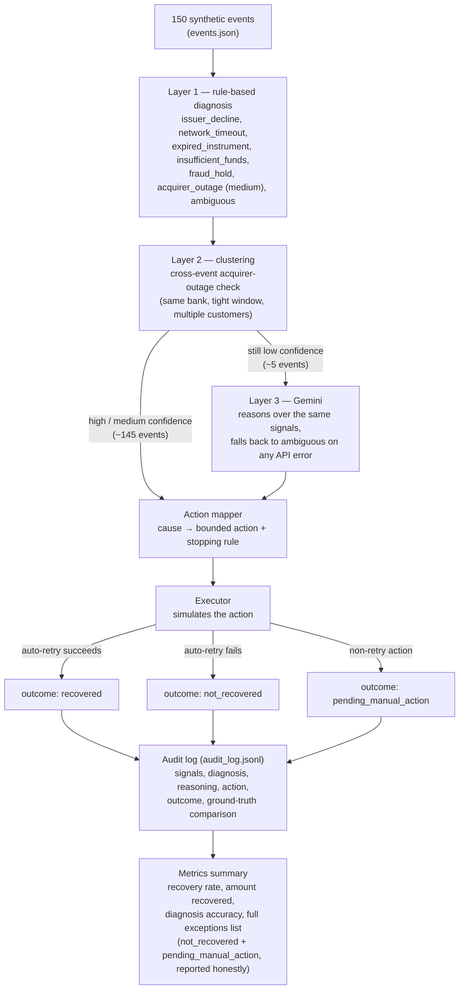
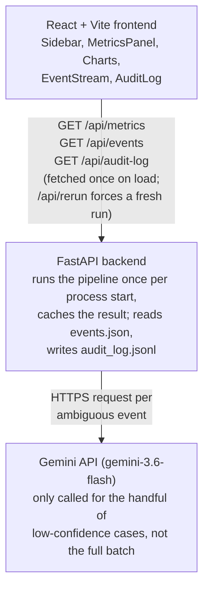

# Architecture

## Processing pipeline

What happens to a single event, from raw signal to logged outcome.
Most events resolve in Layers 1–2; only genuinely ambiguous cases
reach Gemini.

## System architecture

How the pieces are actually deployed and talk to each other — separate
from the per-event logic above.

## Diagnosis rules (Layer 1)

| Signal | Cause |
|---|---|
| error_code in fraud/risk codes | fraud_hold (highest priority) |
| timeout-style error code AND latency_ms > 3500 | network_timeout |
| error_code indicates expired/invalid instrument, or instrument's own expiry has passed | expired_instrument |
| error_code in acquirer-side codes | acquirer_outage (medium confidence at single-event level) |
| explicit insufficient-funds error_code | insufficient_funds |
| issuer decline error_code | issuer_decline (confidence downgraded to medium if amount is high, since insufficient_funds can't be fully ruled out from the code alone) |
| nothing matches cleanly | ambiguous → routed to Gemini (Layer 3) |

Layer 1 alone reaches ~94% accuracy against the synthetic ground truth;
the remaining gap is closed by Layer 2 (cluster upgrades) and Layer 3
(Gemini on genuinely ambiguous cases).

## Recovery action mapping

| Cause | Action | Stopping rule |
|---|---|---|
| network_timeout | retry immediately, same route | max 2 retries |
| issuer_decline | retry after cooldown (~6h) | max 2 retries |
| insufficient_funds | delay retry (~3 days) | max 1 retry |
| expired_instrument | notify customer, no auto-retry | 0 retries |
| acquirer_outage | retry via alternate route | max 1 retry, then escalate |
| fraud_hold | escalate to manual review | 0 retries |
| ambiguous | escalate to manual review | 0 retries |

## Frontend

- **Sidebar** — grouped navigation (Event Stream, Audit Trail, About), dark
  minimal shadcn-inspired visual style
- **MetricsPanel** — headline numbers (recovery rate, amount recovered,
  diagnosis accuracy) plus a status breakdown and the honest exceptions list
- **Charts** — recovery rate by cause (bar), cumulative amount recovered
  over the batch (line), both color-matched to the cause palette used
  throughout the dashboard
- **EventStream** — filterable, cause-coded cards showing each event's
  diagnosis, confidence, reasoning, action, and outcome
- **AuditLog** — expandable table with every decision, its signals, and a
  ground-truth correctness check, for full traceability

## Why this design

- **Two-layer diagnosis** separates fast/explainable rule-based classification
  (handles the majority of clear-cut cases) from cross-event reasoning
  (acquirer-outage clustering), which cannot be detected from a single event
  in isolation.
- **LLM used selectively**, not universally — Gemini is only called for
  ambiguous cases, keeping the system fast, cheap, and auditable for the
  ~90% of clear-cut events while still using AI meaningfully where rules
  alone are insufficient.
- **Every decision is logged** with the signals considered and the reasoning,
  satisfying the track's requirement for an audit trail and honest,
  non-cherry-picked exception reporting.